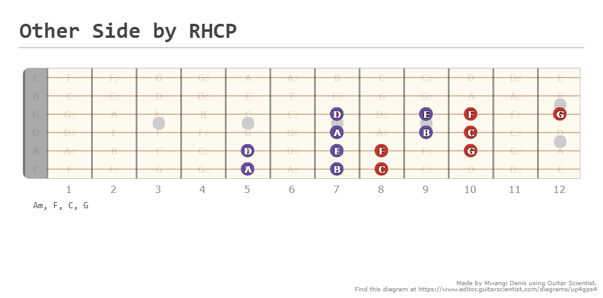

For this Project I'm trying to
# figure out the fretboard
from a YouTube Video called, ***"hidden neck pattern that will tell you every chord or note in any key"***

### Aim:
Analyze the Songs i like and figure out their secret as I learn.

Song 1: Other Side by RHCP;

Am, F, C, G

Song 2: Round Here by Counting Crown

C, D, Em, G

Song 3: 3AM by Matchbox 20.
G, Cadd9, maybe a D

Big Girls DOnt Cry by Fergie
Verse = G, C, D
Chorus = C, G, D , Am

Diary of Jane by breaking Benjamin
Try key of Bm

# The Theory

Starting from the Key of A major
	A-B-C#-D-E-F#-G#-A
Remember major scale intervals are **WWHWWWH** while Minor scale intervals are **WHWWHWW**

Go to the below position

Images courtesy of [Guitar Scientist](https://www.guitarscientist.com/generator/)

The 1st three (in reds) are major.
The move 2 frets down...the next three ,in blue are minor chords, and the last is a diminished.

For Major Scale

Am for example
Minor scale intervals are WHWWHWW

A-B-C-D-E-F-G-A

Analyse the Songs i like and figure out their secret as I learn.

Song 1: Other Side by RHCP;

Am, F, C, G

Song 2: Round Here by Counting Crown

C, D, Em, G

Song 3: 3AM by Matchbox 20.
G, Cadd9, maybe a D

Big Girls DOnt Cry by Fergie
Verse = G, C, D
Chorus = C, G, D , Am

Diary of Jane by breaking Benjamin
Try key of Bm

